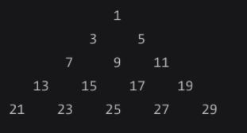

# algorithms
Repository to hold algorithms descriptions and solutions in multiple programing languages, as practice.

- [algorithms](#algorithms)
  - [List of algorithms to implement:](#list-of-algorithms-to-implement)
    - [Max Chars](#max-chars)
    - [Fibonacci with 2 variables](#fibonacci-with-2-variables)
    - [Matrix Spiral](#matrix-spiral)
    - [Revert a number](#revert-a-number)
    - [Array Chunk](#array-chunk)
    - [Capitalize a string](#capitalize-a-string)
    - [Steps](#steps)
    - [Pyramid](#pyramid)
    - [Weave](#weave)
    - [Queue From Stacks](#queue-from-stacks)
    - [Permutation](#permutation)
    - [Row Sum Of Triangle Of Odd Numbers](#row-sum-of-triangle-of-odd-numbers)
    - [Sums](#sums)
      - [Can Sum](#can-sum)
      - [How Sum](#how-sum)
      - [Best Sum](#best-sum)
    - [Construct](#construct)
      - [Can Construct](#can-construct)
      - [How Construct](#how-construct)
      - [All Construct](#all-construct)
    - [First Non Repeating Character](#first-non-repeating-character)
    - [Palindromic Substring](#palindromic-substring)
    - [Digit At](#digit-at)
    - [Sorting](#sorting)

## List of algorithms to implement:

### Max Chars
Receive a strings and return the most repeated character.
Given "abcdefacasdfaaaa" should return "a", because the "a" is the most repeated character in that string.

### Fibonacci with 2 variables
Return the value of the fibonacci number at the fibonacci position of n, where n is a positive number.
Given 6, return 8. Given 7, return 13, etc.
Only use a loop and 2 integers to hold the fibonacci values to solve the problem.

### Matrix Spiral

Given a number N, create and return a matrix N * N and fill the values in a matrix fashion. Check example image below.

Examples:

```js

matrix(2);

// [[1, 2]
// [4, 3]]

matrix(3);

// [[1, 2, 3],
// [8, 9, 4],
// [7, 6, 5]]

```


### Revert a number
Given an integer, return an integer with the digits reversed. For example:
123 -> 321
500 -> 5
503 -> 305

Solve it any way, but create a final version where only arithmetics is used.

### Array Chunk

Given an array and chunk size, divide the array into many subarrays where each subarray is of the provided size.

Examples:

```js
chunk([1,2,3,4], 2) // -> [[1,2], [3,4]]
chunk([1,2,3,4,5], 2) // -> [[1,2], [3,4], [5]]

```

### Capitalize a string

Give a string, capitalize the first letter of all the words in it.

Examples:
```js
capitalize("this is an example") // -> "This Is An Example"
```

### Steps

Write a function that accepts a positive number n. The function should console.log a step shape with N levels using the # character. Make sure the step has spaces on the right hand side.

Examples:
```js
step(2);

// '# '
// '##'

step(3);

// '#  '
// '## '
// '###'

```

### Pyramid

Write a function that accepts a positive number N.

The function should print a pyramid shape with N levels using the # character.
Make sure the pyramid has spaces on both the left and right hand sides.

Given:

```js
pyramid(2);

' # '
'###'
```
```js
pyramid(3);

'  #  '
' ### '
'#####'

```

```js
pyramid(4);

'   #   '
'  ###  '
' ##### '
'#######'

```

### Weave

Weave receives two queues as arguments and combines the contents of each into a new, third queue.
The third queue should contain the alternating content of the two queues.
The function should handle queues of different lengths, without inserting 'undefined' or 'null' into the new one. If it doesn't have more values, it should try to add any.

Example:

 
```js

// Given:
queue1 = [1,2,3,4]
queue2 = [5,6,7,8]

// return
queue3 = [1,5,2,6,3,7,4,8]

// Given
queue1 = [1,2,3,4,5,6]
queue2 = [7,8,9]

// return
queue3 = [1,7,2,8,3,9,4,5,6]

```

### Queue From Stacks

Implement a Queue data structure using two stacks.
Create another abstraction that holds the tow stacks and provide queue methods to access this abstraction. Only use the `pop` and `push` methods of the stacks to simulate the queue.

### Permutation

Given a string S, return a list with all the permutation of that string.

Given S = "abc", return [abc, acb, bac, bca, cab, cba]

### Row Sum Of Triangle Of Odd Numbers

Given a triangle of consecutive odd numbers.

If given 1, return 1.
If given 2, return the sum of the numbers in the second row, of 3 + 5 => 8.
If given 3, return the sum of the numbers in the third row, of 7 + 9 + 11 => 27.



### Sums

#### Can Sum
Given a number `N`, and an array of numbers `numbers`, verify if you can recreate the target number `N` summing numbers from the `numbers` array.
Return true if it's possible to create the target number `N` summing numbers from the `numbers` array. Return false otherwise.


Given

n = 7
numbers = [2, 3, 4, 7]

return true because you can create the n 7 from the numbers array.

Given

n = 5
numbers [2,4,6]

Return false because 5 cannot be recreated from any combination of numbers from numbers.

Use any combination of numbers and use any numbers as many times as needed.

Write a function solution(n, numbers)

#### How Sum
Like Can Sum, but return an array showing which numbers from the `numbers` when summed will produce the number `N`.
#### Best Sum
Like Can Sum and How Sum, but should return an array with the minimum numbers from the `numbers` array that summed will produce the number `N`.

Check the dedicated folder for this problem, for more details.
### Construct


#### Can Construct

Create a function `function solution(str, words)` that checks whether a string can be recreated from a bank or words (array of strings), how it can be created and how many times it can be created from that word bank. Use as many words from the word bank as you want.

Given

s = "hello"

And an array:

words = ["he", "l", "o", "llo"]

Return true, because you can use values from the words array to recreate the 'hello' s.

Given

s = "tomorrow"
words = ["to", "m", "rro", "w", "r", "t"]

Return false, because the s "tomorrow" cannot be recreated from the strings given in words array.

#### How Construct
The same as Can Construct, bue returns an array with the strings used from the words array, to create the string s.
#### All Construct
Same as How Construct, but returns an array of arrays, showing each combination of the ways the string s could be formed from the strings in the words array.

Check the dedicated folder for this problem, for more details.

### First Non Repeating Character

Find the first character that doesn't repeat in a string.

Examples:

Given "abcde", return "a" because "a" is the first character that doesn't repeat.
Given "abcda", return "b" because "b" is the first character that doesn't repeat.
Given "abcdeabcdf", return "e", because although "f" doesn't repeat in the string, "e" is the first that doesn't repeat.

Assume a non empty string is given.

### Palindromic Substring

Find the largest sub palindrome in a string.
If there is no palindrome or the palindrome is less than 3 chars, return "none".

Given hellosannasmith, return sannas.
Given abcdefgg, return none

### Digit At

Implement function that receives an int number `num` and an int number `position`, where the `position` is represent the ith digit of `num` to return, counting from the back of the number.

Given `num` = 7895, `position` = 2, return 9, because 9 is the 2nd digit of `num` from the back.

### Sorting

1) Bubble Sort
2) Selection Sort
3) Insertion Sort
4) Merge Sort
5) Quick Sort
6) Heap Sort
7) Radix Sort
8) Bucket Sort
9) Counting Sort
10) Pigeonhole Sort